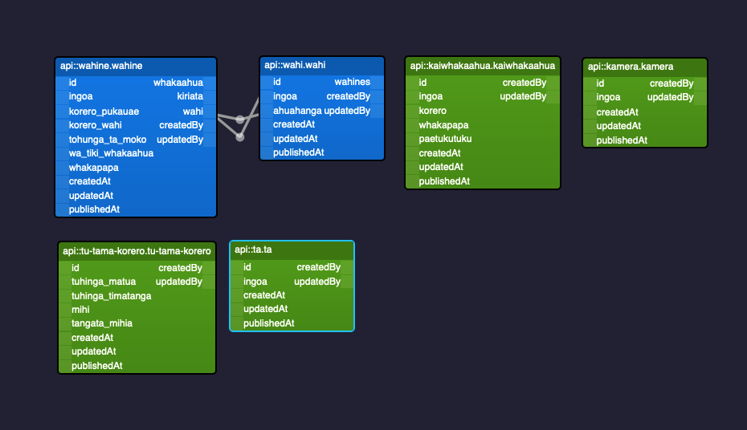

# Pūkauae ki runga Pūkauae ki raro e!

This repo contains code required to implement [Strapi CMS](https://docs.strapi.io) as a back end to the Pūkauae kaupapa. 

### Data Model

### Integration with AWS S3 buckets

The Media Library contains images and videos which are stored at https://pukauae.s3.ap-southeast-2.amazonaws.com and accessible through this app under an ACL.

An IAM User with specific permissions has been set up to access this bucket.

### Data management 

Run `npm run export` to export the DB, project configuration, content, relations, assets, schemas and metadata. File `pukauae-backend-data.tar.gz` will be stored in [aforementioned S3 bucket](https://pukauae.s3.ap-southeast-2.amazonaws.com/data/) 

Run `npm run import` to import this file (if zipped DB file has been downloaded into .)

### `npm run develop`

Start your Strapi application with autoReload enabled. [Learn more](https://docs.strapi.io/developer-docs/latest/developer-resources/cli/CLI.html#strapi-develop)

### `npm run build`

Build your admin panel. [Learn more](https://docs.strapi.io/developer-docs/latest/developer-resources/cli/CLI.html#strapi-build)

## ⚙️ Deployment

TO-DO: [deployment section of the documentation](https://docs.strapi.io/developer-docs/latest/setup-deployment-guides/deployment.html).

